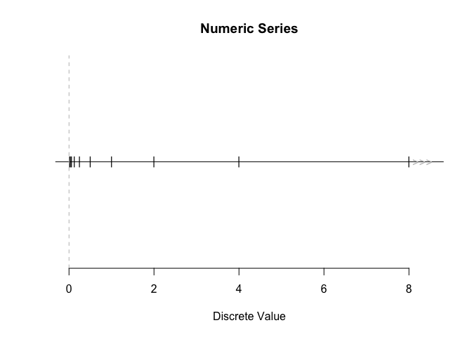

# discretes

The discretes package provides a framework for representing numeric
series that may be finite or infinite. Think `1:Inf`, without storing
all the values explicitly.

Series can be traversed, tested for membership, and queried for limit
points (“sinks”). They can be manipulated to create new series, such as
by transforming or combining.

The name “discretes” reflects the original use case of representing the
support of discrete probability distributions like the Poisson or
Geometric, which are often infinite but enumerable. The package is not
limited to probability applications: it is designed as a general-purpose
tool for working with enumerable numeric series.

## Installation

Install discretes from CRAN with:

``` r
install.packages("discretes")
```

## Examples

``` r
library(discretes)
```

While vectors in R must be finite, this is not a problem for discretes.

``` r
natural0()
#> Integer series of length Inf:
#> 0, 1, 2, 3, 4, 5, ...
```

These objects are referred to as “numeric series”, and have class
“discretes”. Their members are referred to as “discrete values”.

What’s the next discrete value after 10 in the series of integers? Or
the previous five values from 1.3?

``` r
next_discrete(integers(), from = 10)
#> [1] 11
prev_discrete(integers(), from = 1.3, n = 5)
#> [1]  1  0 -1 -2 -3
```

Test whether values are discrete values in a series.

``` r
has_discretes(natural1(), c(0, 1))
#> [1] FALSE  TRUE
```

Perform arithmetic operations on series.

``` r
1 / 2^integers()
#> Reciprocal series of length Inf:
#> Loading required namespace: testthat
#> ..., 0.25, 0.5, 1, 2, 4, 8, ...
```

A new series is created after a base series gets modified. See the
**Creating numeric series** vignette
([`vignette("creating-numeric-series", package = "discretes")`](https://discretes.netlify.app/articles/creating-numeric-series.md))
for what’s allowed (e.g. monotonic transformations) and how to use
[`dsct_transform()`](https://discretes.netlify.app/reference/transform.md)
for custom transformations.

### Sinks

That last series above, `1 / 2^integers()`, has a sink[¹](#fn1) at 0
(approached from the right) and a sink at infinity, best seen by
plotting:

``` r
x <- 1 / 2^integers()
plot(x)
```



Notice that there are infinitely many discrete values close to 0.

``` r
num_discretes(x, from = 0, to = 1)
#> [1] Inf
```

There is no such thing as a “next” value when looking left of the sink.

``` r
next_discrete(x, from = -1)
#> numeric(0)
```

You can ask whether a sink exists directly.

``` r
has_sink_in(x, from = 0, to = 1)
#> [1] TRUE
has_sink_at(x, 0, dir = "right")
#> [1] TRUE
```

## Vignettes

- **Creating numeric series** — Base series, arithmetic, and custom
  manipulations.
  [`vignette("creating-numeric-series", package = "discretes")`](https://discretes.netlify.app/articles/creating-numeric-series.md)
- **Querying a numeric series** — Traversing with
  `next_discrete`/`prev_discrete`, membership with `has_discretes`, and
  extracting values with
  [`get_discretes_at()`](https://discretes.netlify.app/reference/get_discretes.md)
  /
  [`get_discretes_in()`](https://discretes.netlify.app/reference/get_discretes.md).
  [`vignette("querying-numeric-series", package = "discretes")`](https://discretes.netlify.app/articles/querying-numeric-series.md)
- **Tolerance** — How `tol` is used in membership and traversal.
  [`vignette("tolerance", package = "discretes")`](https://discretes.netlify.app/articles/tolerance.md)
- **Signed zero** — Behaviour of +0 and -0 in numeric series.
  [`vignette("signed_zero", package = "discretes")`](https://discretes.netlify.app/articles/signed_zero.md)

## Limitations

The series supported by the package include arithmetic series like
integers, finite series from a numeric vector, and series created from
them (see the **Creating numeric series** vignette). Specialized series
like the Fibonacci numbers are not explicitly supported. Dense countable
sets like the rational numbers are also not supported because they do
not have a well-defined notion of local successor/predecessor.

## Code of Conduct

Please note that the discretes project is released with a [Contributor
Code of
Conduct](https://contributor-covenant.org/version/2/1/CODE_OF_CONDUCT.html).
By contributing to this project, you agree to abide by its terms.

## Similar Packages

- [‘Zseq’](https://cran.r-project.org/package=Zseq) provides access to
  named integer sequences (e.g., Fibonacci numbers, prime numbers), but
  does not provide a general framework for constructing and transforming
  numeric series.
- [‘sets’](https://cran.r-project.org/web/packages/sets/index.html)
  focuses on finite set operations and abstract set algebra, rather than
  structured numeric series.
- [‘set6’](https://CRAN.R-project.org/package=set6) supported infinite
  sets via object-oriented abstractions, but is no longer available on
  CRAN.
- [‘peruse’](https://jacgoldsm.github.io/peruse/) provides tools for
  iterating general sequences, but does not focus on algebraic
  manipulation or structured numeric series.

## Acknowledgements

Development of this package would not have been possible without the
funding and support of the [European Space
Agency](https://www.esa.int/), [BGC Engineering
Inc.](https://www.bgcengineering.ca/), and the [Politecnico di
Milano](https://www.polimi.it/). The need for this package arose from
work on the [probaverse](https://probaverse.com/) project, which aims to
provide tools for probabilistic modeling and inference in R.

------------------------------------------------------------------------

1.  Or more precisely, a limit point.
